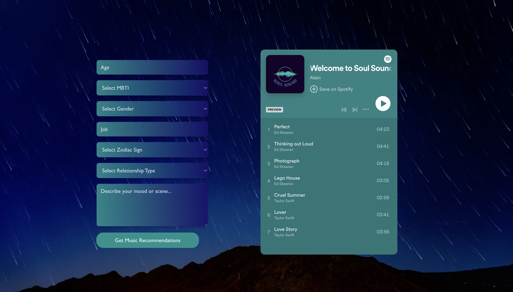

# SoulSound

Tired of the same tunes every day? You've found the perfect spot to explore new music that resonates with your very essence. SoulSound is dedicated to uncovering the music that speaks to the depths of your soul, offering you a uniquely personalized listening experience.

## Preparation

In the project directory, you need to first install the following by running the commands in your terminal:

* `npm install express`
* `npm install npm-run-all --save-dev`
* `npm install dotenv --save-dev`
* `npm install express --save-dev`
* `npm install request --save-dev`
* `npm install http-proxy-middleware --save-dev`
* `npm install react-router-dom`

## How to run SoulSound
Run the following command on your terminal on separate terminal windows:
* `node server/index.js`
* `node server/server_init.js`
* `node server/server.js`
* `npm start`

With these, a webpage will be launched 🎉🎉

## How to start using SoulSound

1. Sign up for a Spotify account
2. Login to your Spotify (move your mouse to the left side of the page, a panel will appear)
3. Answer the questions accordingly
4. Tell us about how you are feeling 
5. Start enjoying the customized music for you 😉
6. If you are still unsure, click `Get Started` button to see the tutorial

## Team Information
### If you encounter any difficulty, do not hesitate drop any one of us an email 😆

