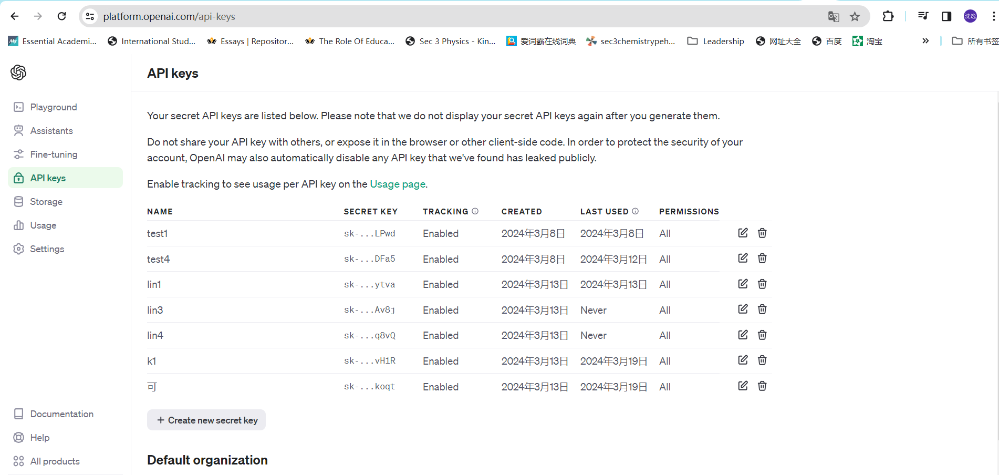
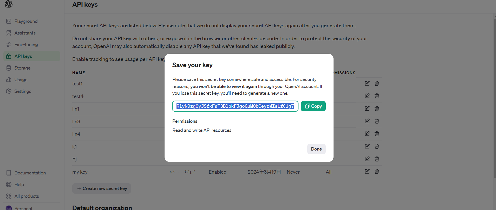
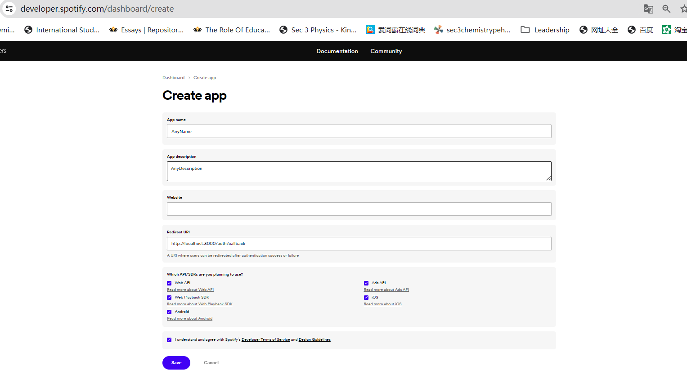
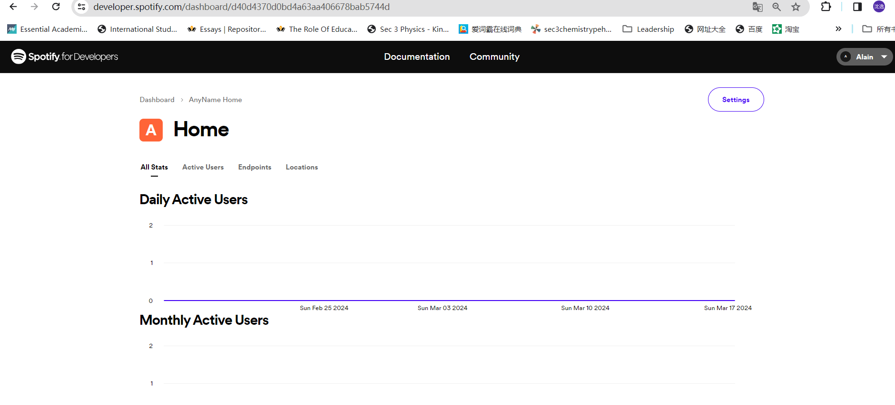
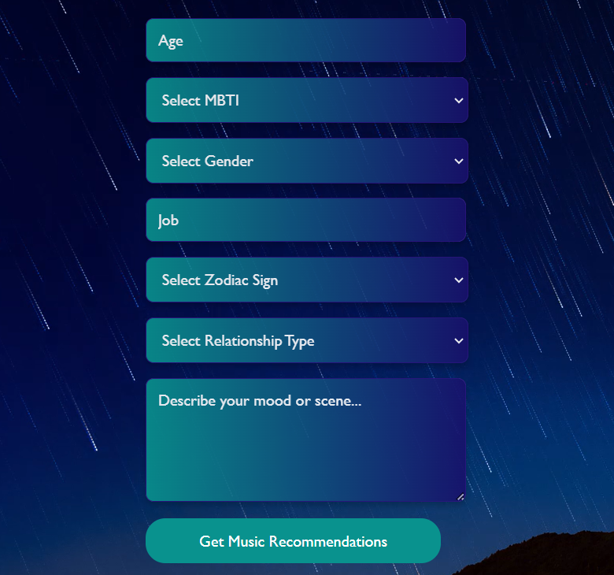
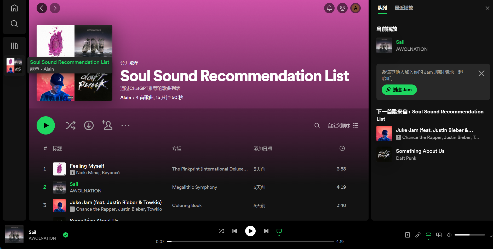

# SoulSound

*

Tired of the same tunes every day? You've found the perfect spot to explore new music that resonates with your very essence. SoulSound is dedicated to uncovering the music that speaks to the depths of your soul, offering you a uniquely personalized listening experience.

## Preparation

Before diving into the SoulSound experience, a few preparations are necessary. Follow these steps to set up your environment:

### Package Installation

In the project directory, you need to first install the essential packages. Open your terminal and execute the following commands:

* `npm install express`
* `npm install npm-run-all --save-dev`
* `npm install dotenv --save-dev`
* `npm install express --save-dev`
* `npm install request --save-dev`
* `npm install http-proxy-middleware --save-dev`
* `npm install react-router-dom`

This will install all necessary dependencies, including Express for your server backend, React Router for front-end routing, and several development tools to enhance your development workflow.

### Generating GPT API Key

Next, generate a GPT API key:

1. Sign up or log in Chat-GPT and navigate to the API keys section.
2. Visit the OpenAI API portal:https://platform.openai.com/api-keys

3. Generate a new API key to be used in your project.

4. Copy down the API key.

5. repeate step 3-4 twice to paste to different key into server/server_init.js and server/server.js respectively.

This API key allows your application to communicate with GPT services, enabling AI-driven music recommendations.

### Creating Spotify App

To integrate Spotify's music services:

1. Create a Spotify premium account.
2. Head over to the Spotify Developer Dashboard:https://developer.spotify.com/dashboard

3. Create a new application.Remember to tick all the boxes shown in the picture below, and replace the "Redirect URI" section with http://localhost:3000/auth/callback

4. Click save and then click setting.

4. Copy your Client ID and Client Secret into server/index.js.

These credentials are crucial for your application to interact with Spotify's Web API, fetching personalized music recommendations for your users.

## How to Run SoulSound

Get SoulSound up and running by executing the following commands in separate terminal windows:

* `node server/index.js`
* `node server/server_init.js`
* `node server/server.js`
* `npm start`

A webpage will launch, ushering you into the SoulSound experience 🎉🎉.

## How to Start Using SoulSound

Follow these steps to dive into your personalized music journey:

1. Sign up for a Spotify account.
2. Log in to your Spotify account (hover over the left side of the page to reveal the panel).
* 
3. Answer the on-screen questions to tailor your experience.
* 
4. Share how you're cuurently feeling or what image is in your mind to fine-tune your music recommendations.
5. Enjoy the customized music selections tailored just for you, by clicking on "Get Music Recommendations" 😉.

* 
6. Now, you shall see a "Soul Sound Recommendation Music" automatically generated inside your local Spotify app.
* 

7. You shall also link to Web Playback SDK and scroll down the web page to enjoy the music list.
*
*
6. Need guidance? Click the `Get Started` button for a walkthrough.
* 

## Team Information

Encountering any difficulties? Feel free to drop us an email 😆.

---

Make sure to replace placeholders like the OpenAI and Spotify URLs with actual links and adjust any project-specific details as necessary.